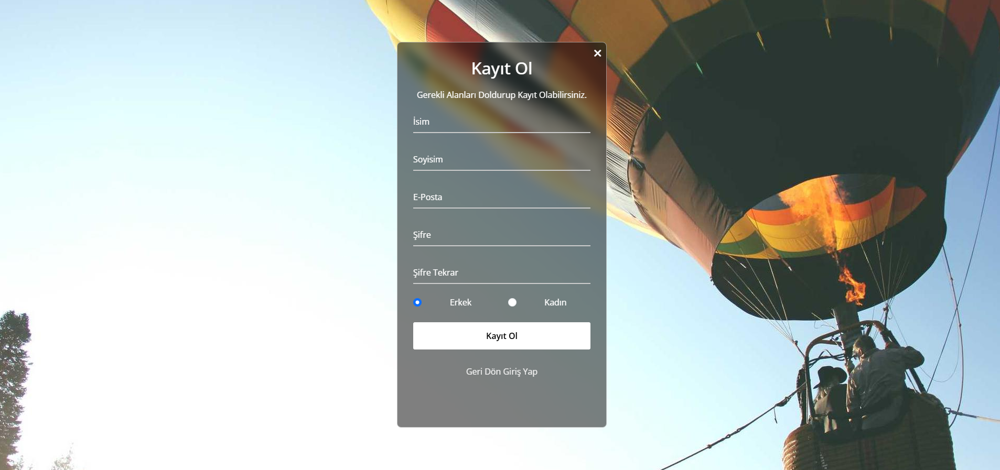
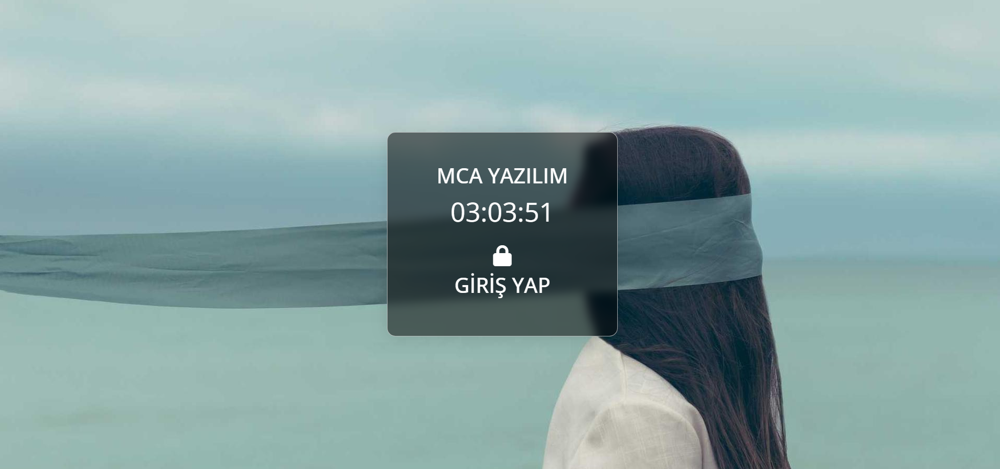
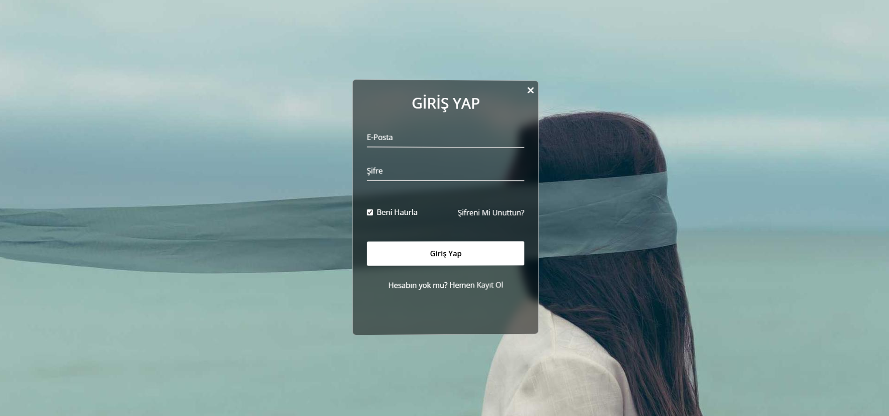
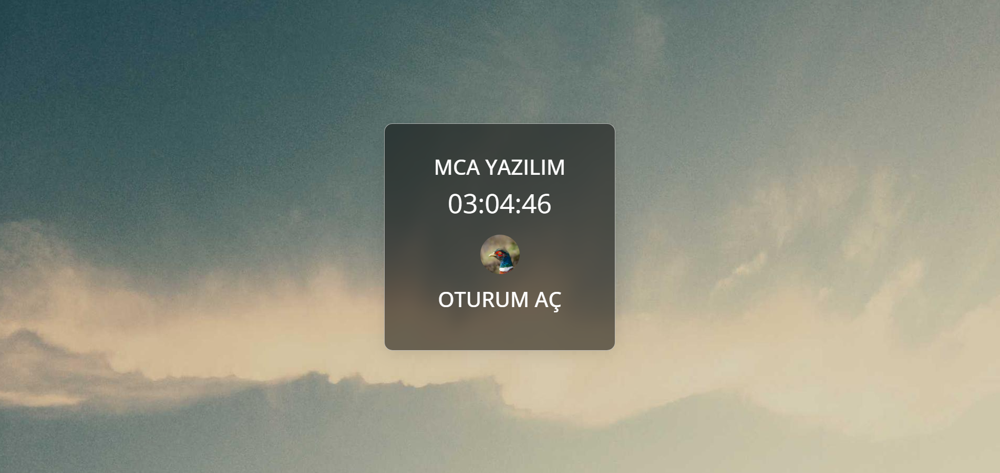
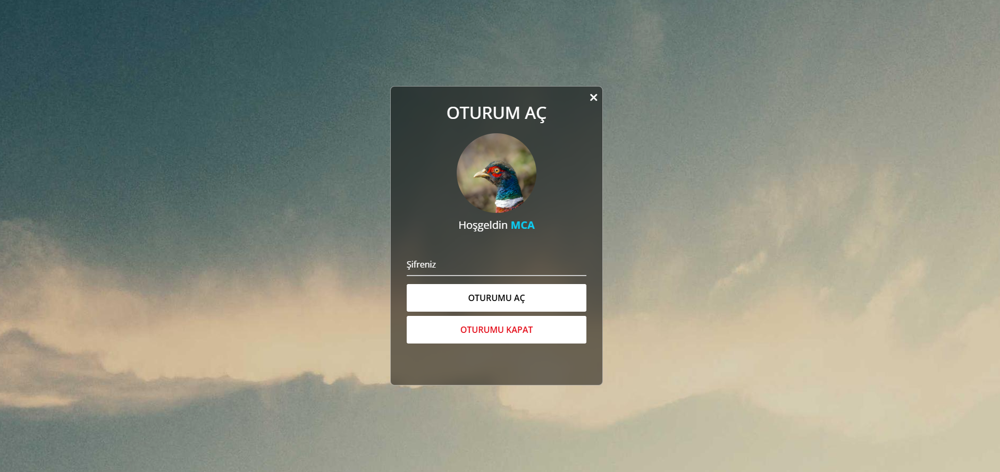
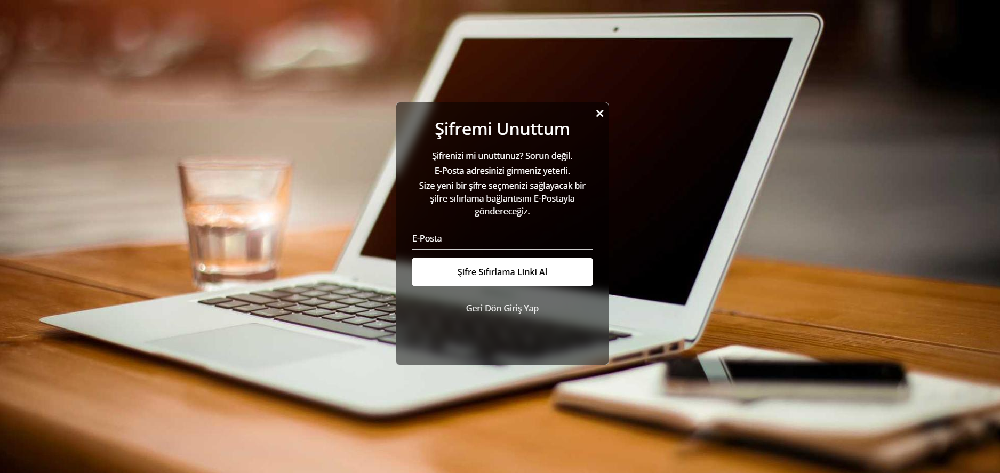
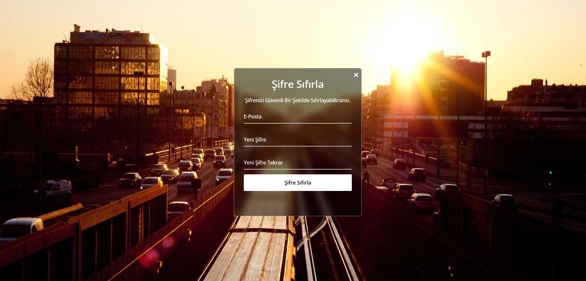

## Kullanılan Eklentiler

Zorunlu olmasa da sayfaların genelinde kullanılan eklentiler. 

- Bootstrap 5
- JQuery
- FontAwesome
- Vanilla Tilt

!!! Ekran Fotoğrafları İle Sizdeki Görseller Farklı Olabilir. !!!
 
!!! assets/js/custom.js dosyasın'da en alt bölümde 43 - 47. satırlar arasında 
arkaplan resimlerini https://unsplash.it/ üzerinden sayfa her yenilendiğinde sayfanın boyutuna göre otomatik çekiyor !!!

## Ekran Fotoğrafları

<h3> Kayıt Ekranı : </h3>

<h3> Giriş Ekranı : </h3>

<h3> Oturum Açma Ekranı : </h3>

<h3> Şifre mi Unuttum Ekranı : </h3>

<h3> Şifre Sıfırlama Ekranı : </h3>

## Lisans

Bu tasarım açık kaynaklı bir yazılımdır.

Bu tasarımı alıp üzerinde istediğiniz gibi değişiklik yapabilirsiniz.

Bu tasarım üzerinden hiç kimseden maddi ücret talep edemezsiniz.

[MIT license](https://opensource.org/licenses/MIT).
